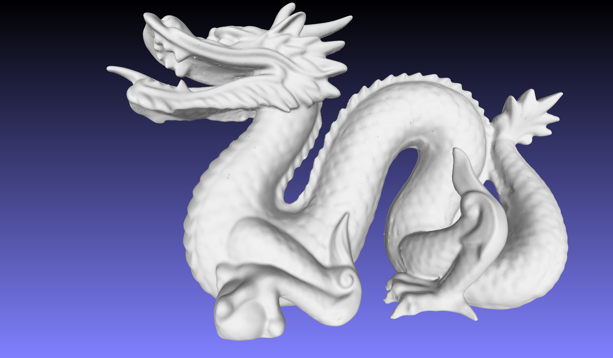
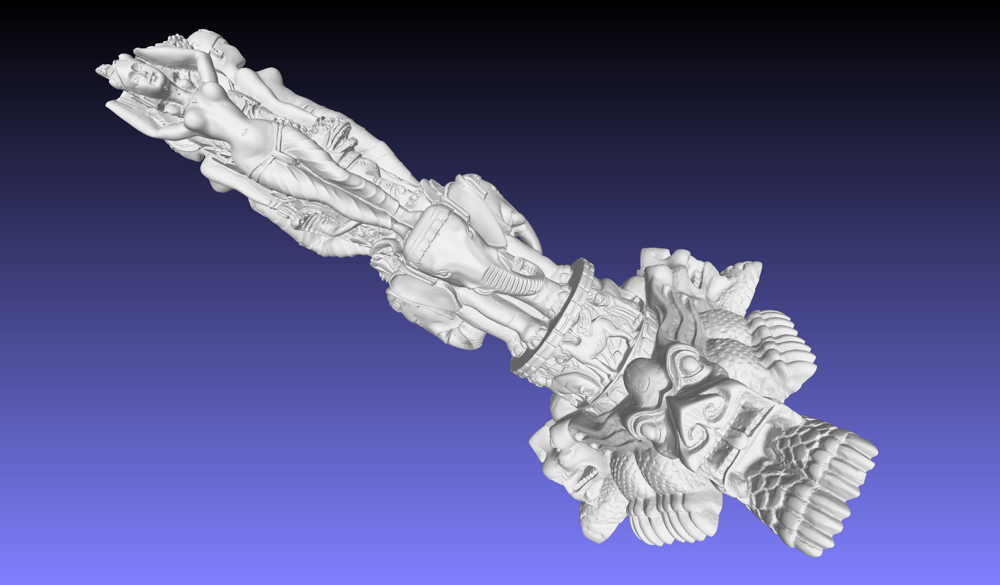
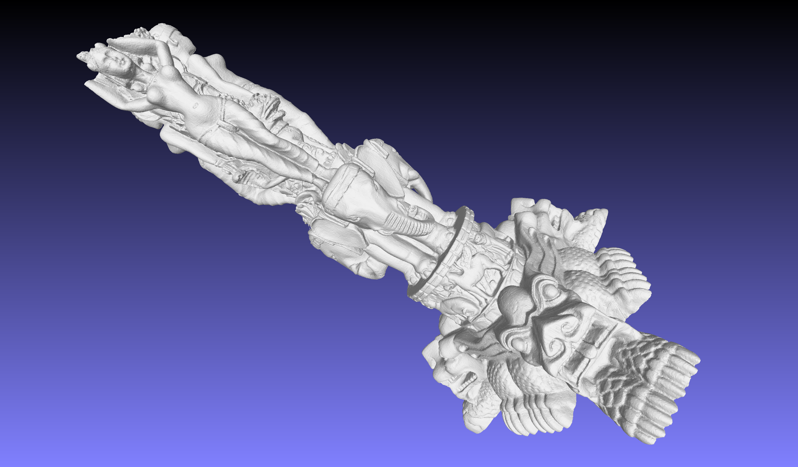
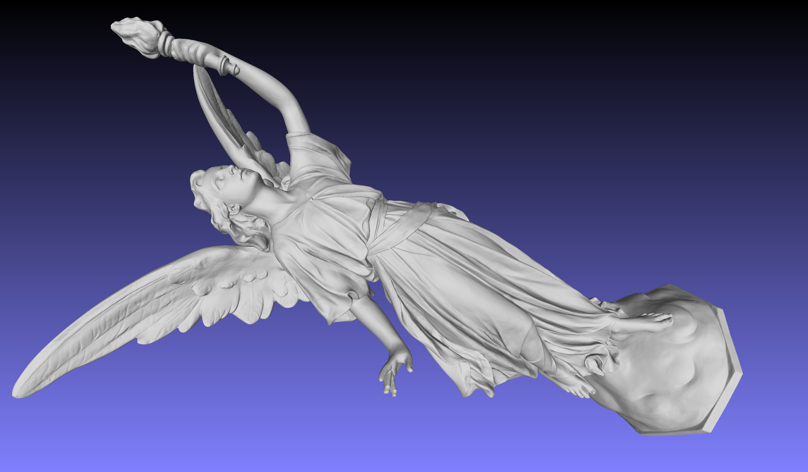
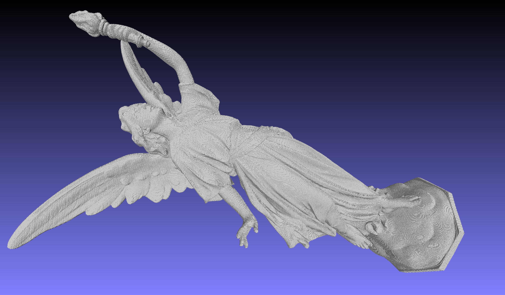

# 3D TSDF Volume Encoder

This repository implements [TSDF Volume Compression with Axis-wise Variable Resolution Representation and Selective Latent Code Encoding].

***(Due to intellectual property issues related to this research, all code will be released upon the official publication of the paper.)***

# Abstract

This paper presents a novel approach for compressing truncated signed distance function (TSDF) volumes, leveraging two key contributions: an axis-wise variable resolution representation and a latent code selection-based compression model. The axis-wise variable resolution representation adapts the resolution along each axis based on local geometric complexity, effectively reducing the data size while preserving intricate geometric details. The proposed compression model employs optimal latent code selection, leading to improved compression efficiency and reduced computational complexity. The combination of these contributions results in a synergistic effect, enabling enhanced compression efficiency and preservation of geometric details in high-resolution TSDF volumes. 

# Encoder Performance

Below are comparisons of the compression results using 3D models from The Stanford 3D Scanning Repository (http://graphics.stanford.edu/data/3Dscanrep/) with Google Draco and our TSDF Volume encoder.
In this experiment, for TSDF volume compression, we converted the mesh into a TSDF volume using Open3D.

## Dragon (http://graphics.stanford.edu/data/3Dscanrep/)   

Uncompressed (33.2 MB)

Draco QP=10 (489.53 KB)

Ours RP=8 (470.97 KB, TSDF volume dimension: 512 x 384 x 228)

   
| QP | KB       | Chamfer Dist. | Rate Point | KB       | Chamfer Dist. |
|----|----------|---------------|------------|----------|---------------|
| 8  | 314.7529 | 0.000662      | 0          | 151.8047 | 0.000226      |
| 9  | 388.373  | 0.00037       | 1          | 154.5332 | 0.000216      |
| 10 | 489.5342 | 0.000189      | 2          | 155.8838 | 0.000199      |
| 11 | 607.5693 | 9.47E-05      | 3          | 160.9619 | 0.000184      |
| 12 | 702.7988 | 4.68E-05      | 4          | 172.5967 | 0.000159      |
| 13 | 824.1943 | 2.43E-05      | 5          | 200.4932 | 0.000135      |
| 14 | 944.4453 | 1.21E-05      | 6          | 233.582  | 0.000125      |
| 15 | 1059.284 | 5.96E-06      | 7          | 394.9395 | 0.000115      |
|    |          |               | 8          | 470.9717 | 8.24E-05      |
|    |          |               | 9          | 1020.904 | 7.79E-05      |
|    |          |               | 10         | 1969.086 | 7.78E-05      |
|    |          |               | 11         | 3295.279 | 7.47E-05      |

## Thai Statuette (http://graphics.stanford.edu/data/3Dscanrep/)   

Uncompressed (181 MB)

Draco QP=10 (3420.00 KB)

Ours RP=8 (1762.87 KB, TSDF volume dimension: 544 x 864 x 480)

   
| QP | KB       | Chamfer Dist. | Rate Point | KB       | Chamfer Dist. |
|----|----------|---------------|------------|----------|---------------|
| 8  | 2107.906 | 1.128602      | 0          | 567.1553 | 0.220818      |
| 9  | 2644.877 | 0.586638      | 1          | 581.7754 | 0.213324      |
| 10 | 3420.002 | 0.315989      | 2          | 589.6455 | 0.201068      |
| 11 | 4298.582 | 1.74E-01      | 3          | 604.791  | 0.187856      |
| 12 | 4968.762 | 9.25E-02      | 4          | 656.043  | 0.1668        |
| 13 | 6311.539 | 4.64E-02      | 5          | 752.0625 | 0.146347      |
| 14 | 7942.594 | 2.32E-02      | 6          | 867.2246 | 0.125319      |
| 15 | 9585.34  | 1.16E-02      | 7          | 1473.012 | 0.124741      |
|    |          |               | 8          | 1762.874 | 8.97E-02      |
|    |          |               | 9          | 3519.432 | 8.86E-02      |
|    |          |               | 10         | 7194.209 | 8.78E-02      |
|    |          |               | 11         | 12655.88 | 8.50E-02      |

## Lucy (http://graphics.stanford.edu/data/3Dscanrep/)   

Uncompressed (508 MB)

Draco QP=10 (7496.56 KB)

Ours RP=8 (1238.13 KB, TSDF volume dimension: 544 x 352 x 864)

| QP | KB       | Chamfer Dist. | Rate Point | KB       | Chamfer Dist. |
|----|----------|---------------|------------|----------|---------------|
| 8  | 4908.327 | 4.524714      | 0          | 398.876  | 0.878961      |
| 9  | 5889.229 | 2.292013      | 1          | 411.1514 | 0.853156      |
| 10 | 7496.559 | 1.191156      | 2          | 412.127  | 0.784781      |
| 11 | 9660.032 | 6.63E-01      | 3          | 424.8574 | 0.726831      |
| 12 | 11964.37 | 3.62E-01      | 4          | 452.2217 | 0.63297       |
| 13 | 14889.5  | 1.84E-01      | 5          | 516.8369 | 0.535803      |
| 14 | 18046.21 | 9.29E-02      | 6          | 591.543  | 0.45767       |
| 15 | 22045.25 | 4.66E-02      | 7          | 981.5674 | 0.469914      |
|    |          |               | 8          | 1238.128 | 3.29E-01      |
|    |          |               | 9          | 2562.738 | 3.13E-01      |
|    |          |               | 10         | 5209.644 | 3.14E-01      |
|    |          |               | 11         | 9079.151 | 3.00E-01      |
