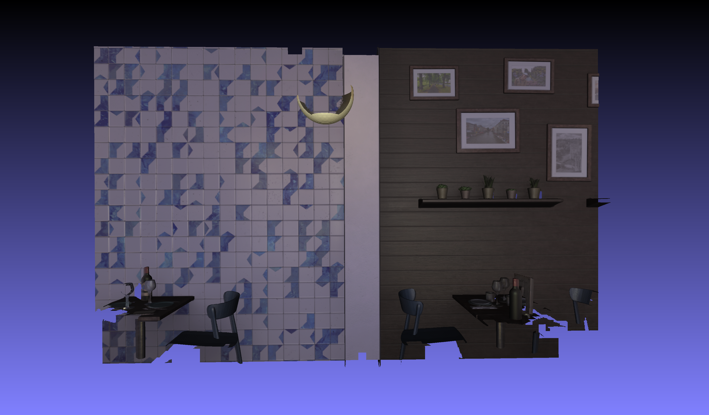

# 3D TSDF Volume Encoder

This repository implements [TSDF Volume Compression with Axis-wise Variable Resolution Representation and Selective Latent Code Encoding].

***(Due to intellectual property issues related to this research, all code will be released upon the official publication of the paper.)***

# Abstract

This paper presents a novel approach for compressing truncated signed distance function (TSDF) volumes, leveraging two key contributions: an axis-wise variable resolution representation and a latent code selection-based compression model. The axis-wise variable resolution representation adapts the resolution along each axis based on local geometric complexity, effectively reducing the data size while preserving intricate geometric details. The proposed compression model employs optimal latent code selection, leading to improved compression efficiency and reduced computational complexity. The combination of these contributions results in a synergistic effect, enabling enhanced compression efficiency and preservation of geometric details in high-resolution TSDF volumes. 

# Our Evaluation Datasets

Our evaluation dataset consists of 4K RGB-D images acquired using a 21 x 21 frontal-facing camera array in virtual indoor scenes. 
Once we find a hosting solution, these datasets will be made available for public access.

The linked ply files for each scene are 3D meshes created through TSDF fusion.

## Hotel Near

3.904 x 2.816 x 0.768 meters 

[Hotel-Near.ply](https://drive.google.com/file/d/1-mFjmX7QNxwACvzzr-RxRFNxbT7rQ3r3/view?usp=sharing)

## Hotel Far

6.208 x 3.584 x 3.52 meters

[Hotel-Far.ply](https://drive.google.com/file/d/1xLIs8EeL2JSFiT_lNng3YIcnIM09dNGD/view?usp=sharing)

## Restaurant Near

5.504 x 3.328 x 1.408 meters

[Restr-Near.ply](https://drive.google.com/file/d/17ldMha9JBSUaD29q1RMIOJ6XD1B6tSr5/view?usp=sharing)

## Restaurant Far

7.872 x 3.648 x 4.928 meters

[Restr-Far.ply](https://drive.google.com/file/d/1ZY6k61YzDYsyUlgMUTt6-l2eCdh-u3iH/view?usp=sharing)

# Compression Pipeline

A detailed description of the compression pipeline can be found at the following link.
[(compression pipeline)](https://github.com/moolgom/3DLCSEncoder/blob/main/PIPELINE.md)

# Our TSDF Volume Encoder Performance (with Single Res. TSDF Volume)

Below are comparisons of the compression results using 3D models from the Stanford 3D Scanning Repository (http://graphics.stanford.edu/data/3Dscanrep/) with Google Draco (https://github.com/google/draco) and our TSDF volume encoder.
In this experiment, for TSDF volume compression, we converted the mesh into a TSDF volume using Open3D (http://www.open3d.org/).
Due to the loss of detail during the TSDF volume conversion process, we don't get good results at high bitrates. 
However, it shows very good compression efficiency at low bitrates compared to Draco's mesh compression.

## Thai Statuette (http://graphics.stanford.edu/data/3Dscanrep/)   

Uncompressed (181 MB)

Draco QP=10 (3420.00 KB)

Ours RP=8 (1762.87 KB, TSDF volume dimension: 544 x 864 x 480)

(On the left side is the result of Draco, and on the right side is the result of our TSDF volume encoder.)
   
| QP | KB       | Chamfer Dist. | Rate Point | KB       | Chamfer Dist. |
|----|----------|---------------|------------|----------|---------------|
| 8  | 2107.906 | 1.128602      | 0          | 567.1553 | 0.220818      |
| 9  | 2644.877 | 0.586638      | 1          | 581.7754 | 0.213324      |
| 10 | 3420.002 | 0.315989      | 2          | 589.6455 | 0.201068      |
| 11 | 4298.582 | 1.74E-01      | 3          | 604.791  | 0.187856      |
| 12 | 4968.762 | 9.25E-02      | 4          | 656.043  | 0.1668        |
| 13 | 6311.539 | 4.64E-02      | 5          | 752.0625 | 0.146347      |
| 14 | 7942.594 | 2.32E-02      | 6          | 867.2246 | 0.125319      |
| 15 | 9585.34  | 1.16E-02      | 7          | 1473.012 | 0.124741      |
|    |          |               | 8          | 1762.874 | 8.97E-02      |
|    |          |               | 9          | 3519.432 | 8.86E-02      |
|    |          |               | 10         | 7194.209 | 8.78E-02      |
|    |          |               | 11         | 12655.88 | 8.50E-02      |

## Lucy (http://graphics.stanford.edu/data/3Dscanrep/)   

Uncompressed (508 MB)

Draco QP=10 (7496.56 KB)

Ours RP=8 (1238.13 KB, TSDF volume dimension: 544 x 352 x 864)

***Even at a compression rate of x420 times, acceptable geometric quality is maintained.***

| QP | KB       | Chamfer Dist. | Rate Point | KB       | Chamfer Dist. |
|----|----------|---------------|------------|----------|---------------|
| 8  | 4908.327 | 4.524714      | 0          | 398.876  | 0.878961      |
| 9  | 5889.229 | 2.292013      | 1          | 411.1514 | 0.853156      |
| 10 | 7496.559 | 1.191156      | 2          | 412.127  | 0.784781      |
| 11 | 9660.032 | 6.63E-01      | 3          | 424.8574 | 0.726831      |
| 12 | 11964.37 | 3.62E-01      | 4          | 452.2217 | 0.63297       |
| 13 | 14889.5  | 1.84E-01      | 5          | 516.8369 | 0.535803      |
| 14 | 18046.21 | 9.29E-02      | 6          | 591.543  | 0.45767       |
| 15 | 22045.25 | 4.66E-02      | 7          | 981.5674 | 0.469914      |
|    |          |               | 8          | 1238.128 | 3.29E-01      |
|    |          |               | 9          | 2562.738 | 3.13E-01      |
|    |          |               | 10         | 5209.644 | 3.14E-01      |
|    |          |               | 11         | 9079.151 | 3.00E-01      |

## Dragon (http://graphics.stanford.edu/data/3Dscanrep/)   

Uncompressed (33.2 MB)

Draco QP=10 (489.53 KB)

Ours RP=8 (470.97 KB, TSDF volume dimension: 512 x 384 x 228)

   
| QP | KB       | Chamfer Dist. | Rate Point | KB       | Chamfer Dist. |
|----|----------|---------------|------------|----------|---------------|
| 8  | 314.7529 | 0.000662      | 0          | 151.8047 | 0.000226      |
| 9  | 388.373  | 0.00037       | 1          | 154.5332 | 0.000216      |
| 10 | 489.5342 | 0.000189      | 2          | 155.8838 | 0.000199      |
| 11 | 607.5693 | 9.47E-05      | 3          | 160.9619 | 0.000184      |
| 12 | 702.7988 | 4.68E-05      | 4          | 172.5967 | 0.000159      |
| 13 | 824.1943 | 2.43E-05      | 5          | 200.4932 | 0.000135      |
| 14 | 944.4453 | 1.21E-05      | 6          | 233.582  | 0.000125      |
| 15 | 1059.284 | 5.96E-06      | 7          | 394.9395 | 0.000115      |
|    |          |               | 8          | 470.9717 | 8.24E-05      |
|    |          |               | 9          | 1020.904 | 7.79E-05      |
|    |          |               | 10         | 1969.086 | 7.78E-05      |
|    |          |               | 11         | 3295.279 | 7.47E-05      |

# Our TSDF Volume Encoder Performance (with Axis-wise Mult. Res. TSDF Volume)

# Axiw-wise Variable Resolution Representation

The results below show the data size and distortion compared to the original geometry of meshes created using single-resolution and axis-variable resolution TSDF volume representations.

## Single Resolution TSDF Volume

8520 KB (PLY size), 0.053485 RMS (Hausdorff dist.) 

## Axiw-wise Variable Resolution TSDF Volume

7636 KB (PLY size), 0.046593 RMS (Hausdorff dist.) 

To Be Updated.

